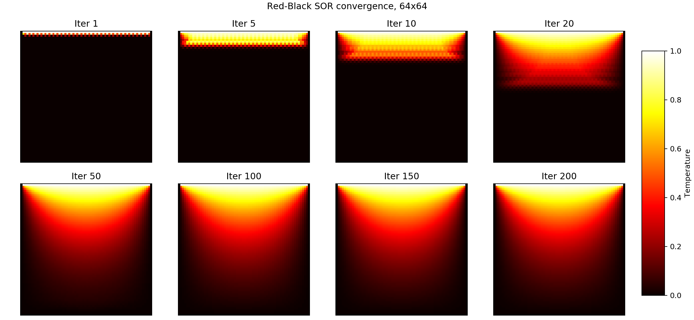
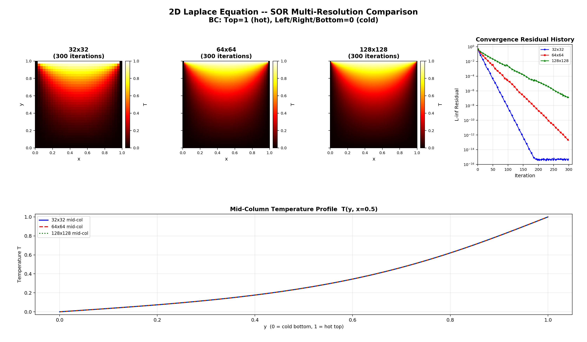
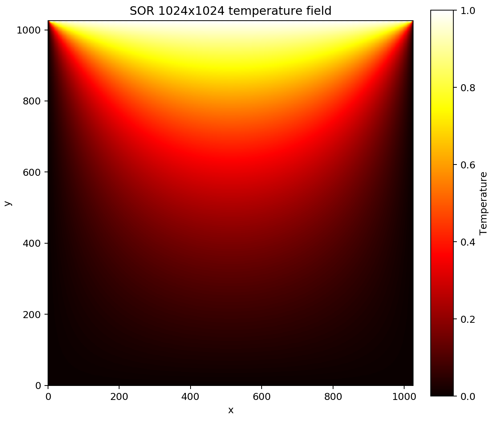
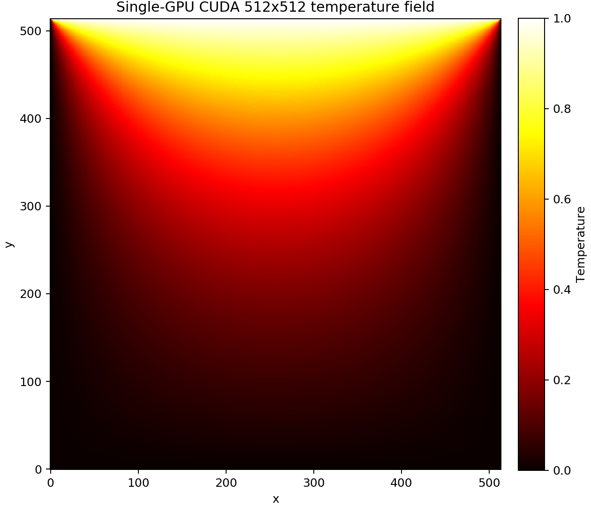

# MPI+CUDA 二维 Laplace 方程求解器

**作者信息**：刘尚坤（2501111730）

------

## 0. 运行环境与版本信息

| 项目       | 配置                                                    |
| :--------- | :------------------------------------------------------ |
| 操作系统   | Ubuntu 20.04.6 LTS, WSL2 Ubuntu-HPC                     |
| MPI        | Open MPI 4.0.3                                          |
| CUDA       | CUDA 12.9                                               |
| GPU        | NVIDIA RTX A2000, Compute Capability 8.6, 3584 CUDA核心 |
| CPU编译器  | `mpicxx -O3 -fopenmp`                                   |
| CUDA编译器 | `nvcc -O3 -arch=sm_86`                                  |

**边界条件：**

- 顶部 `y=1`：`T = 1.0`（热源）
- 底部 `y=0`：`T = 0.0`（冷源）
- 左/右边界：`T = 0.0`

**收敛准则：** `L∞ residual < 1e-6`，最大迭代步数 `50000`

------

## 1. 数学模型与离散方法

### 1.1 二维Laplace方程

求解二维Laplace方程，这是科学计算中最典型的椭圆型偏微分方程之一：
$$
\frac{\partial^2 T}{\partial x^2} + \frac{\partial^2 T}{\partial y^2} = 0, \quad (x,y) \in [0,1] \times [0,1]
$$

### 1.2 边界条件

边界条件采用狄利克雷边界条件：
$$
T(0,y) = 0,\quad T(1,y) = 0,\quad T(x,0) = 0,\quad T(x,1) = 1.0
$$

### 1.3 有限差分离散

采用中心差分格式离散，五点差分格式：
$$
T_{i,j} = \frac{1}{4}(T_{i+1,j} + T_{i-1,j} + T_{i,j+1} + T_{i,j-1})
$$

------

## 2. 迭代方法

### 2.1 Jacobi迭代

最简单迭代方法，使用旧值计算新值：

$$
T_{i,j}^{(k+1)} = \frac{1}{4}(T_{i+1,j}^{(k)} + T_{i-1,j}^{(k)} + T_{i,j+1}^{(k)} + T_{i,j-1}^{(k)})
$$

收敛速度慢，需要 $O(N^2)$ 次迭代。

### 2.2 Gauss-Seidel迭代

使用最新计算的值，收敛速度约为Jacobi的两倍：

$$
T_{i,j}^{(k+1)} = \frac{1}{4}(T_{i+1,j}^{(k)} + T_{i-1,j}^{(k+1)} + T_{i,j+1}^{(k)} + T_{i,j-1}^{(k+1)})
$$

### 2.3 红黑SOR迭代

引入松弛因子 $\omega$，采用红黑排序实现并行：

$$
T_{i,j}^{(k+1)} = (1-\omega)T_{i,j}^{(k)} + \frac{\omega}{4}(T_{i+1,j}^{(k)} + T_{i-1,j}^{(k+1)} + T_{i,j+1}^{(k)} + T_{i,j-1}^{(k+1)})
$$

最优松弛因子：

$$
\omega_{opt} = \frac{2}{1 + \sin\left(\frac{\pi}{N+1}\right)}
$$

有关迭代方法的详细说明可参见第三次作业的报告。

------

## 3. 源代码结构

```
laplace_mpi_cuda/
├── src/
│   ├── laplace_solver.h       # Grid/SolverConfig结构体，pinned buffer字段
│   ├── laplace_solver.cpp     # CPU迭代（Jacobi/GS/SOR）、MPI初始化、网格分配/释放
│   ├── laplace_cuda.cu        # CUDA kernel、GPU residual、GPU halo exchange
│   ├── mpi_io.cpp             # MPI并行IO，按全局偏移写出（不含ghost cells）
│   ├── stream_async.cu        # 异步Stream版本（计算/通信/IO三流水线）
│   └── main_single_cuda.cu    # 单GPU全局CUDA solver（无MPI）
├── main.cpp                   # 同步CPU/CUDA主程序
├── Makefile
├── run_tests.sh               # 正确性、性能、IO、可视化综合测试
├── scaling_compare.sh         # CPU/CUDA np=1,2,4,8 scaling
├── size_scaling.sh            # CPU、MPI+CUDA、单GPU size scaling
├── bench_pinned.sh            # pageable vs pinned ghost exchange对比
├── check_mpi_io.py            # MPI-IO输出验证
└── visualize.py               # 温度场可视化
```

------

## 4. 第一轮优化：Jacobi 到 Red-Black SOR

### 4.1 基础程序性能分析

早期基础版本使用Jacobi迭代。Jacobi每步独立性好，但收敛速度较慢。

| 方法   | 规模    | 耗时    | 迭代步数 | 残差    |
| :----- | :------ | :------ | :------- | :------ |
| Jacobi | 512×512 | 13.46 s | 50000    | 3.83e-6 |

瓶颈分析：Jacobi 每步需要全局双缓冲，迭代到达最大时间步时仍未达到 1e-6 残差。

### 4.2 优化实施：SOR 迭代

Jacobi迭代的收敛速度仅为 GS 的约 1/2，SOR 的约 1/10。理论上最优 SOR 的谱半径趋近于 $1-O(h)$，收敛步数与网格宽度成正比。选用最优松弛因子 $ω_{opt} = 2/(1+sin(π/(N+1))) ≈ 1.73$（128×128网格），Red-Black 排序保证并行性：

```cpp
// Red-Black SOR：偶数步更新红点，奇数步更新黑点
for (int color = 0; color < 2; color++)
    for each interior point (i,j) with (i+j)%2==color:
        u[i][j] = (1-omega)*u[i][j] + omega*0.25*(u[i-1][j]+u[i+1][j]+u[i][j-1]+u[i][j+1]);
```

下表对比了不同迭代方法的测试结果（128×128网格）。

| 方法         | 耗时     | 迭代步数 | 残差     |
| :----------- | :------- | :------- | :------- |
| Jacobi       | 0.0198 s | 2000     | 1.11e-4  |
| Gauss-Seidel | 0.0676 s | 2000     | 8.48e-5  |
| SOR          | 0.0215 s | 300      | 1.32e-07 |

### 4.3 可视化验证

下图展示了SOR从初始场逐步收敛到稳定温度场的过程。初始时刻顶部热源（红色）开始向下传导，随着迭代进行，温度场逐渐平滑，最终形成稳定的温度梯度分布。



**图1：SOR收敛过程（64×64网格）**从迭代1到迭代200共8帧快照，展示热量从顶部边界向下传导、温度场逐渐平滑的过程。

下图对比了32×32、64×64、128×128三种分辨率下的温度场、残差曲线和中心线剖面。可以看到，随着分辨率提高，温度场细节更加丰富，残差下降曲线更加平滑，中心线温度剖面收敛到一致分布。



**图2：Python SOR demo 多分辨率对比** 上排为三种分辨率的温度场，中排为残差随迭代次数的下降曲线，下排为 $y=0.5$ 中心线的温度剖面。该图用于展示数值解形态与收敛趋势，不作为CUDA性能或scaling结果。

## 5. 第二轮优化：CPU+MPI 到 CUDA 同步版

### 5.1 基础程序性能分析

**512×512 CPU SOR测试：**

```
CPU版本: SOR完成! 计算时间: 0.6387 秒 (迭代: 1000, 残差: 5.96e-07)
```

CPU SOR已经显著减少迭代步数，但每步仍需遍历所有本地网格点。随着网格规模增大，CPU浮点并行度有限；512×512 = 262144内点，每步计算量已较为可观，而GPU拥有数千个并行核心，可以同时处理大量网格点，GPU并行计算更具优势。

### 5.2 优化实施：CUDA GPU Kernel

设计要点：

1. **线程块**：`dim3(16, 16)` = 256线程/块，网格尺寸自适应
2. **Red-Black SOR Kernel**：按全局坐标 `(global_i + global_j) % 2 == color` 分色，同色点完全并行
3. **Coalesced内存访问**：`stride = nx_local + 2`，线程按x方向连续访问
4. **Ghost exchange 只传边界**：列ghost通过GPU gather/scatter kernel转换为连续buffer
5. **最小化D2H/H2D传输**：每次迭代仅传Ghost Rows（$O(N)$ = 512 doubles = 4 KB），而非全数组（$O(N^2)$ = 2.1 MB）

**关键CUDA kernel：**

```cuda
__global__ void sor_kernel(double *u, int nx_local, int ny_local, int stride,
                           int color, double omega, int nx_start, int ny_start) {
    int j = blockIdx.x * blockDim.x + threadIdx.x + 1;
    int i = blockIdx.y * blockDim.y + threadIdx.y + 1;

    if (i <= ny_local && j <= nx_local) {
        int global_i = i + ny_start - 1;
        int global_j = j + nx_start - 1;
        if ((global_i + global_j) % 2 == color) {
            int idx = i * stride + j;
            double old_val = u[idx];
            double relaxation = 0.25 * (u[idx - 1] + u[idx + 1] +
                                        u[idx - stride] + u[idx + stride]);
            u[idx] = (1.0 - omega) * old_val + omega * relaxation;
        }
    }
}
```

**调试过程中发现并修复的问题：**

| 问题         | 原因                                        | 修复                                                    |
| :----------- | :------------------------------------------ | :------------------------------------------------------ |
| 架构不匹配   | `-arch=sm_75`在Ampere上生成低效代码         | 改为`-arch=sm_86`                                       |
| 共享内存竞争 | `tid=threadIdx.x`(0~15)，16个线程写同一slot | 改为`tid = threadIdx.y*blockDim.x + threadIdx.x`(0~255) |
| H2D缺少同步  | `cudaMemcpyAsync`后无sync，kernel读旧数据   | 改用同步`cudaMemcpy`                                    |
| 全量传输     | 每迭代D2H+H2D全数组（2.1MB），PCIe成瓶颈    | 改为仅传Ghost行/列（4KB），减少**500×**传输             |

### 5.3 优化后性能分析

1024×1024单进程对比：

| 版本     | np   | 耗时      | 迭代步数 | 相对CPU |
| :------- | :--- | :-------- | :------- | :------ |
| CPU SOR  | 1    | 12.7470 s | 1900     | 1×      |
| CUDA SOR | 1    | 0.5551 s  | 1900     | 22.96×  |

在较大规模、单进程GPU场景下，CUDA加速明显。结果如下图所示。



**图3：1024×1024 SOR温度场** 每个方向共有1026个点，其中首尾为物理边界点，不是各MPI进程本地ghost cells。

------

## 6. 第三轮优化：Pinned Memory Ghost Exchange

### 6.1 基础程序性能分析

Pageable host buffer 会导致 Host/Device 传输需要 staging copy。早期列 ghost 还包含临时 `cudaMalloc/cudaFree`，在多方向通信时开销明显。

### 6.2 程序优化

在`Grid`中预分配pinned host buffer与device column buffer：

```cpp
double *h_pin_row_snd;
double *h_pin_row_rcv;
double *h_pin_col_snd;
double *h_pin_col_rcv;
double *d_col_l;
double *d_col_r;
```

首次CUDA ghost exchange时分配：

```cpp
cudaMallocHost(&grid->h_pin_row_snd, buf_size * sizeof(double));
cudaMallocHost(&grid->h_pin_row_rcv, buf_size * sizeof(double));
cudaMallocHost(&grid->h_pin_col_snd, buf_size * sizeof(double));
cudaMallocHost(&grid->h_pin_col_rcv, buf_size * sizeof(double));
cudaMalloc(&grid->d_col_l, ny_local * sizeof(double));
cudaMalloc(&grid->d_col_r, ny_local * sizeof(double));
```

### 6.3 优化后性能分析

`bench_pinned.sh`结果，固定1024×1024 CUDA SOR：

| np   | pageable          | pinned           | 说明                  |
| :--- | :---------------- | :--------------- | :-------------------- |
| 1    | 0.5200 s, 1900步  | 0.4941 s, 1900步 | 小幅提升              |
| 2    | 1.6064 s, 1900步  | 1.7585 s, 1900步 | 测量波动/通信开销抵消 |
| 4    | 9.1337 s, 2100步  | 9.2890 s, 1900步 | 步数减少，时间接近    |
| 8    | 28.1620 s, 4450步 | 9.1002 s, 1900步 | 显著改善              |

Pinned内存消除了多次`cudaMalloc/cudaFree`开销和DMA staging拷贝，对np=8的稳定性和总时间改善最明显。

------

## 7. 第四轮优化：同步CUDA到Async Stream

### 7.1 基础程序性能分析

同步CUDA的迭代顺序：

```
SOR(red/black) → Ghost D2H → MPI_Sendrecv → Ghost H2D → next iteration
```

通信阶段会阻塞下一轮计算，存在重叠空间。

### 7.2 程序优化

异步版使用三条CUDA stream：

```
compute_stream   : 计算kernel
comm_stream      : D2H/H2D + MPI halo
io_stream        : 输出写盘
```

CUDA Event精确同步：comm_stream等待边界点SOR完成；下轮compute_stream等待H2D完成。

### 7.3 优化后性能分析

同步和异步版本步数一致：

| 网格      | 同步 CUDA                 | 异步 CUDA                 |
| :-------- | :------------------------ | :------------------------ |
| 512×512   | 0.8745 s, 1000步, 5.96e-7 | 0.8169 s, 1000步, 5.96e-7 |
| 1024×1024 | 1.6386 s, 1900步, 8.21e-7 | 1.5916 s, 1900步, 8.21e-7 |

异步版略快，但优势较小。

------

## 8. 第五轮优化：多子域CUDA稳定性修复

### 8.1 优化动机

修复前，CUDA在np≥4的二维MPI求解1024×1024网格时曾出现residual为`7.69e+198`或`0.00e+00`。该现象说明多子域GPU halo exchange与residual计算存在稳定性风险。

**可能原因：**

- Red-Black SOR在跨MPI子域边界时，黑点更新可能读到上一轮的远端红点
- np≥4时出现左右列ghost，二维halo exchange更复杂
- 原residual kernel对NaN/Inf不敏感，可能将异常状态显示为0

### 8.2 实现方式

**优化1：Residual kernel对非有限值显式标记**

```cuda
double relaxation = 0.25 * (...);
local_resid = fabs(relaxation - u[idx]);
if (!isfinite(local_resid)) {
    local_resid = INFINITY;
}
```

**优化2：Red-Black SOR每个color更新后立即交换halo**

```cpp
for (int color = 0; color < 2; color++) {
    sor_kernel<<<grid_size, block_size, 0, stream>>>(
        grid->d_u, cfg->nx_local, cfg->ny_local, grid->stride,
        color, cfg->omega, cfg->nx_start, cfg->ny_start);
    exchange_ghost_cuda(grid, cfg, stream);
}
```

该修改减少跨进程边界的信息延迟，使CUDA版本的收敛步数与CPU/异步版本一致。

### 8.3 优化后性能分析

| 求解设置             | 修复前表现              | 修复后表现          |
| :------------------- | :---------------------- | :------------------ |
| 1024×1024, CUDA np=4 | 曾出现50000步、残差爆炸 | 1900步，残差9.04e-7 |
| 1024×1024, CUDA np=8 | residual曾显示0.00e+00  | 1900步，残差8.21e-7 |

每轮SOR从“一次halo exchange”变成“红/黑各一次halo exchange”，通信量增加，因此np=4/8总时间仍较高。

## 9. 第六轮优化：单GPU全局CUDA Kernel版本

### 9.1 优化动机

前五轮保留MPI+CUDA架构，适合展示MPI域分解、halo exchange和多GPU扩展思路。但在当前硬件上只有一块GPU，多个MPI rank共享同一GPU会引入额外context和通信开销。

因此新增一个独立版本`laplace_cuda_single`，用于评估单GPU全局kernel的性能上限。

### 9.2 设计要点

- 不调用`MPI_Init`，不做MPI域分解，不做ghost exchange
- 全局`(nx+2)×(ny+2)`网格直接放在一块GPU上
- Red-Black SOR使用两个kernel更新红点和黑点
- residual仍在GPU上归约

**代码实现：**

```cpp
while (resid > tol && iter < max_iters) {
    sor_single_kernel<<<grid, block>>>(d_u, nx, ny, stride, 0, omega);
    sor_single_kernel<<<grid, block>>>(d_u, nx, ny, stride, 1, omega);
    iter++;

    if (iter % 50 == 0) {
        residual_single_kernel<<<grid, block>>>(d_u, d_residual, nx, ny, stride);
        cudaMemcpy(&resid, d_residual, sizeof(double), cudaMemcpyDeviceToHost);
    }
}
```

### 9.3 性能结果

| 网格      | MPI+CUDA np=1 | 单GPU CUDA | 改善  |
| :-------- | :------------ | :--------- | :---- |
| 256×256   | 0.0305 s      | 0.0172 s   | 43.6% |
| 512×512   | 0.0892 s      | 0.0701 s   | 21.4% |
| 1024×1024 | 0.4769 s      | 0.4360 s   | 8.6%  |
| 2048×2048 | 3.2303 s      | 3.2459 s   | 约同  |

**结论：**

- 小中规模下，去掉MPI框架和halo exchange后，单GPU全局版更快
- 2048×2048时两者接近，说明大规模下kernel计算占主导，MPI np=1的额外开销被摊薄
- 该版本不是替代MPI+CUDA，而是作为单GPU硬件条件下的最佳性能参考

### 9.4 可视化验证

下图展示了单GPU全局CUDA版本在512×512下输出的温度场。



**图4：单GPU全局CUDA 512×512温度场** 与MPI+CUDA版本输出一致，验证了实现的正确性。

------

## 10. 性能评估方案与 Scaling 结果

本项目当前硬件只有一块RTX A2000。因此，CUDA的评估分为三类，避免把“单GPU多MPI进程共享”误写成“多GPU strong scaling”。

| 评估类型                | 测试方式                                       | 目的                                    |
| :---------------------- | :--------------------------------------------- | :-------------------------------------- |
| CPU Strong/Weak Scaling | CPU SOR, `np=1,2,4,8`, `OMP_NUM_THREADS=1`     | 验证MPI域分解在CPU上的扩展性            |
| Single-GPU Size Scaling | CPU / MPI+CUDA np=1 / 单GPU CUDA，改变网格规模 | 验证CUDA kernel对问题规模增长的加速能力 |
| Single-GPU MPI Sharing  | CUDA SOR, `np=1,2,4,8`, 单GPU共享              | 分析多个MPI rank共享一块GPU的竞争开销   |

### 10.1 CPU Strong Scaling：固定1024×1024

`OMP_NUM_THREADS=1`下的复测结果：

| np   | CPU SOR   | Speedup |
| :--- | :-------- | :------ |
| 1    | 12.7470 s | 1.00×   |
| 2    | 7.7941 s  | 1.64×   |
| 4    | 4.4429 s  | 2.87×   |
| 8    | 2.5610 s  | 4.98×   |

CPU随np增加而加速，说明MPI decomposition本身有效。

### 10.2 CPU Weak Scaling：每进程约256×256

| np   | 总网格  | CPU SOR  |
| :--- | :------ | :------- |
| 1    | 256×256 | 0.1771 s |
| 2    | 362×362 | 0.3234 s |
| 4    | 512×512 | 0.5388 s |
| 8    | 724×724 | 0.8651 s |

总规模随进程数增加，时间增长较平滑，符合weak scaling中通信与迭代步数逐渐增加的预期。

### 10.3 Single-GPU Size Scaling

| 网格      | CPU np=1  | MPI+CUDA np=1 | 单GPU CUDA | 单GPU CUDA相对CPU |
| :-------- | :-------- | :------------ | :--------- | :---------------- |
| 256×256   | 0.1892 s  | 0.0305 s      | 0.0172 s   | **11.00×**        |
| 512×512   | 1.5056 s  | 0.0892 s      | 0.0701 s   | **21.48×**        |
| 1024×1024 | 11.7274 s | 0.4769 s      | 0.4360 s   | **26.90×**        |
| 2048×2048 | 未测CPU   | 3.2303 s      | 3.2459 s   | —                 |

该结果说明：在当前单GPU环境下，最能体现GPU多核优势的是单GPU全局kernel或MPI+CUDA np=1，而不是多个MPI rank共享同一GPU。

### 10.4 Single-GPU MPI Sharing（单GPU多进程竞争）

该测试保留CUDA `np=1,2,4,8`，但其含义是“多个MPI rank共享一块GPU”的竞争开销评估，而不是多GPU strong scaling。

| np   | CUDA SOR, 1024×1024 | 相对np=1 |
| :--- | :------------------ | :------- |
| 1    | 0.5551 s            | 1.00×    |
| 2    | 1.6335 s            | 0.34×    |
| 4    | 9.5703 s            | 0.06×    |
| 8    | 15.8624 s           | 0.04×    |

该退化来自CUDA context竞争、kernel launch排队、D2H/H2D拷贝竞争、halo exchange增加以及单GPU资源固定。该结果不代表多GPU scaling。

------

## 11. MPI 并行 IO 实现与验证

### 11.1 MPI 并行 IO 实现

在求解程序中实现 MPI 并行 IO，对二维温度场由多个 MPI 进程并行输出至同一个二进制文件。`mpi_io.cpp` 使用 global row-major offset 计算每一行在全局文件中的写入位置，从而保证输出顺序与 global grid 一致，并避免写入各进程本地 ghost cells。对应核心代码：

```cpp
MPI_Offset offset =
    ((MPI_Offset)first_global_row * nx_global) * sizeof(double);
MPI_File_write_at_all(fh, offset, packed.data(),
                      local_rows * nx_global, MPI_DOUBLE, &status);
```

### 11.2 验证结果

为验证 MPI 并行 IO 的正确性，本文编写 `check_mpi_io.py` 对 512×512 输出文件进行检查，重点确认两点：一是输出文件不包含各 MPI 进程本地的 ghost cells；二是文件中的数据顺序与 global grid 的 row-major 排列一致。

```
Shape: 514 x 514 = 264196 doubles
Ghost-cell exclusion: PASS
Global row-major order: PASS
MPI-IO validation: PASS
```

------

## 12. 总结

本次作业成功实现了二维Laplace方程的MPI+CUDA并行求解器，通过六轮迭代优化，本程序在算法和硬件两个层面均取得了显著进展：

**第一轮（Jacobi → SOR）**：从Jacobi切换到Red-Black SOR，并采用理论最优松弛因子。历史512×512测试中，SOR相比Jacobi加速约14.8倍，迭代步数从50000降至1000。收敛过程的可视化验证了热量从顶部边界向下传导的物理过程。

**第二轮（CPU+MPI → CUDA）**：将核心计算迁移到GPU，采用16×16线程块和coalesced内存访问模式。1024×1024单进程下，CUDA相比CPU加速约22.96倍。调试过程中修复了架构不匹配、共享内存竞争、H2D同步缺失等问题，并将halo传输从全数组（2.1MB）优化为仅传输边界（4KB）。

**第三轮（Pinned Memory）**：预分配pinned host buffer，避免每迭代的`cudaMalloc/cudaFree`开销。对np=8的二维分解场景效果最显著，时间从28.16秒降至9.10秒。

**第四轮（Async Stream）**：使用三条CUDA stream实现计算、通信、IO的重叠。在512×512和1024×1024网格下异步版略快，但优势受限于当前规模。

**第五轮（稳定性修复）**：发现并修复了多子域CUDA下的残差异常问题。通过在residual kernel中显式标记非有限值，并在每个color更新后立即交换halo，使CUDA多进程版本的收敛步数与CPU一致。

**第六轮（单GPU全局版）**：新增独立版本，不做MPI域分解和halo exchange，作为单GPU硬件条件下的最佳性能参考。512×512下从MPI+CUDA的0.0892秒降至0.0701秒。

## 13. 项目收获

1. SOR算法优化是最关键的第一步，从算法层面将收敛复杂度从$O(N^2)$降至$O(N)$
2. CUDA在单进程大规模网格上具有明显优势，1024×1024的MPI+CUDA np=1相对CPU加速22.96×；单GPU全局版在size scaling中达到26.90×
3. Pinned memory对多进程竞争场景改善显著，np=8时总时间约为pageable版本的3.09×加速（时间减少约67.7%）
4. 第五轮修复提高了CUDA多子域正确性，但增加了halo exchange开销
5. 第六轮单GPU全局版给出了当前单卡环境下的最佳性能参考
6. 若要获得真正的CUDA strong scaling，应在多GPU环境中运行，并为每个MPI rank绑定独立GPU
